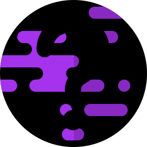

<!-- SHIELDS -->

[![Contributors][contributors-shield]][contributors-url]
[![Stargazers][stars-shield]][stars-url]
[![Issues][issues-shield]][issues-url]
[![MIT License][license-shield]][license-url]

<!-- PROJECT LOGO -->
 

<h3 align="center">Planets info</h3>
    

        An 8-page fact site for all planets in our solar system.
         
        <a href="https://planets-info-riki.vercel.app/">View Demo</a>
        ·
        <a href="https://github.com/Riki9811/planets-info/issues">Report Bug</a>
        ·
        <a href="https://github.com/Riki9811/planets-info/issues">Request Feature</a>
         
    

<!-- TABLE OF CONTENTS -->

    
Table of Contents

    <ol>
        <li><a href="#about-the-project">About The Project</a></li>
        <li><a href="#built-with">Built With</a></li>
        <li><a href="#roadmap">Roadmap</a></li>
        <li><a href="#contributing">Contributing</a></li>
        <li><a href="#license">License</a></li>
        <li><a href="#contact">Contact</a></li>
    </ol>

 

<!-- ABOUT THE PROJECT -->

## About The Project

[![Website Screen Shot][product-screenshot]](https://planets-info-riki.vercel.app/)

This project is an 8-page fact site about our solar system's planets written in typescript with React. Inspired by the <a href="https://www.frontendmentor.io/challenges/planets-fact-site-gazqN8w_f">Frontend Mentor - Planets fact site</a> challenge, the project was built using the free images given as reference on the challenge page and is not intended as a solution.

In addition to the specifications given on Frontend Mentor the web app will present on the home page a stylized and animated model of the solar system which will serve as a second navigation menu. This feature is taken from <a href="https://github.com/tediko/planets-fact">Tediko's solution</a> for the challenge found <a href="https://planets-tediko.netlify.app/">here</a>.

(<a href="#top">back to top</a>)

### Built With

-   [Vite.js](https://vitejs.dev/)
-   [React.js](https://reactjs.org/)
-   [React Router](https://reactrouter.com)
-   [Framer Motion](https://www.framer.com/motion/)
-   [Typescript](https://www.typescriptlang.org/)
-   [Sass](https://sass-lang.com/)

(<a href="#top">back to top</a>)

<!-- ROADMAP -->

## Roadmap

-   [x] Page routing with <a href="https://reactrouter.com">React Router v6</a>.
-   [x] Animated routes with <a href="https://www.framer.com/motion/">Framer Motion</a>.
-   [x] Header with navbar and navigation options.
-   [x] Star background (flickering + shooting stars).
-   [x] Home page solar system with pseudo-realistic animations.
-   [x] Planet page layout depending on user device.
-   [x] Info shower connected to all the routes.
-   [x] CSS polishing.

See the [open issues](https://github.com/Riki9811/planets-info/issues) for a full list of proposed features (and known issues).

(<a href="#top">back to top</a>)

<!-- CONTRIBUTING -->

## Contributing

Contributions are what make the open source community such an amazing place to learn, inspire, and create. Any contributions you make are **greatly appreciated**.

If you have a suggestion that would make this better, you can simply open an issue with the tag "enhancement". Don't forget to give the project a star! Thanks again!

(<a href="#top">back to top</a>)

<!-- LICENSE -->

## License

Distributed under the MIT License. See `LICENSE.txt` for more information.

(<a href="#top">back to top</a>)

<!-- CONTACT -->

## Contact

Riccardo Mariotti - riccardo.mariotti98@gmail.com

Project Link: [https://github.com/Riki9811/planets-info](https://github.com/Riki9811/planets-info)

Online demo: [https://planets-info-riki.vercel.app/](https://planets-info-riki.vercel.app/)

(<a href="#top">back to top</a>)

<!-- MARKDOWN LINKS & IMAGES -->

[contributors-shield]: https://img.shields.io/github/contributors/Riki9811/planets-info.svg?style=for-the-badge
[contributors-url]: https://github.com/Riki9811/planets-info/graphs/contributors
[stars-shield]: https://img.shields.io/github/stars/Riki9811/planets-info.svg?style=for-the-badge
[stars-url]: https://github.com/Riki9811/planets-info/stargazers
[issues-shield]: https://img.shields.io/github/issues/Riki9811/planets-info.svg?style=for-the-badge
[issues-url]: https://github.com/Riki9811/planets-info/issues
[license-shield]: https://img.shields.io/github/license/Riki9811/planets-info.svg?style=for-the-badge
[license-url]: https://github.com/Riki9811/planets-info/blob/master/LICENSE.txt
[product-screenshot]: src/assets/screenshot.png
